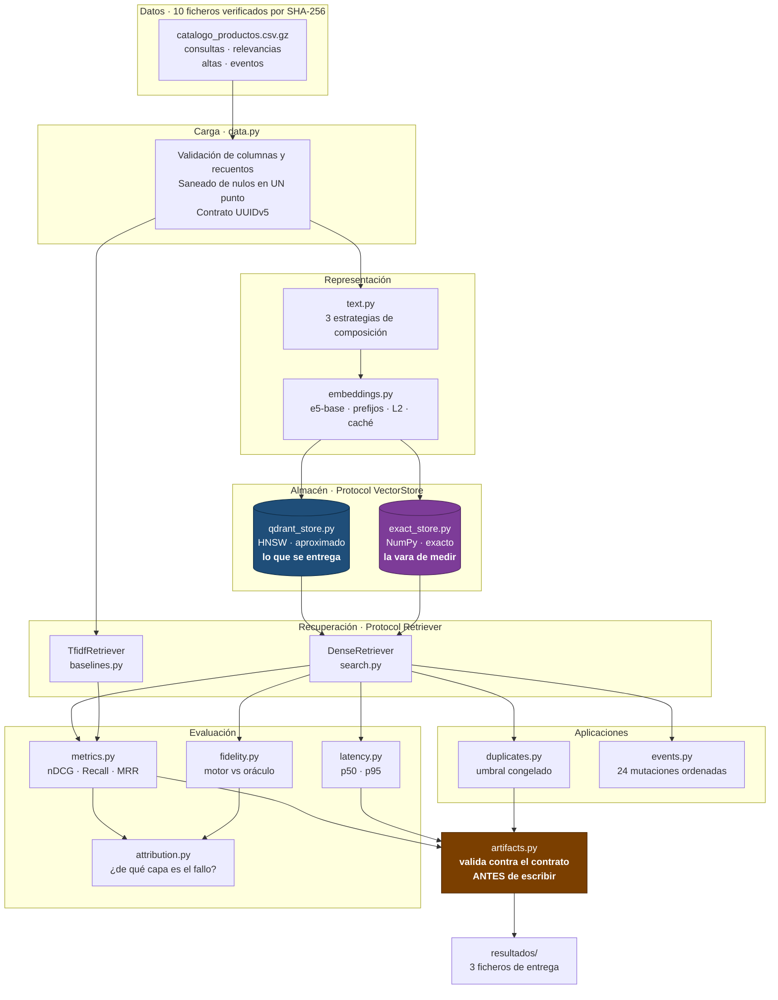
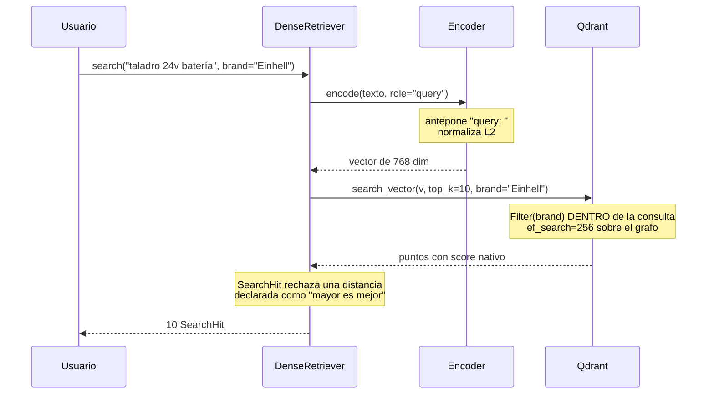

# Arquitectura · Aurum Market

Artefacto de entrega exigido por [RF-25](../specs/01_spec.md). Describe cómo
están organizadas las piezas y, sobre todo, **por qué** están organizadas así:
cada frontera del sistema existe para hacer medible algo que de otro modo no lo
sería.

---

## 1. Vista general



---

## 2. La decisión que sostiene todo lo demás

El sistema construye **dos buscadores sobre exactamente los mismos vectores**:

| | Cómo busca | Papel |
|---|---|---|
| **Motor** · `QdrantStore` | Recorre el grafo HNSW. Rápido y aproximado | Es el producto |
| **Oráculo** · `ExactVectorStore` | Compara contra los 15.000 uno a uno. Lento y exacto | Es la referencia |

Ambos implementan el mismo `Protocol`, así que el código de evaluación **no
puede distinguirlos**. Difieren únicamente en cómo encuentran los vecinos:
mismo modelo, mismo texto, mismos vectores, misma métrica.

Esa igualdad forzada es lo que convierte una diferencia entre ellos en
información utilizable:

```
el oráculo acierta y el motor no   →  la pérdida es del ÍNDICE
los dos fallan igual               →  el problema es de REPRESENTACIÓN
```

Sin el oráculo, un nDCG de 0,54 sería un número sin diagnóstico. Con él, se
puede afirmar —y se afirma, en `attribution.json`— que el índice no pierde ni un
solo candidato y que todo el error es del modelo de embeddings.

Es también el motivo de que no se use FAISS ([ADR-003](../specs/decisiones/ADR-003-oraculo-exacto.md)):
con vectores normalizados, la búsqueda exacta sobre una matriz de 23 MB son
cinco líneas de álgebra lineal.

---

## 3. El esquema de la colección

```
colección  aurum-market-catalogo
├── vectores    768 dimensiones · distancia COSINE · normalizados
├── ID          record_id = uuid5(namespace, product_id)
│               └── estable ⇒ reingerir SOBRESCRIBE, nunca duplica
├── payload     product_id · title · brand · color
│               locale · catalog_version · active
│               └── nulos como cadena vacía, NUNCA "nan" ni None
└── índices
    ├── HNSW            m=24 · ef_construct=120 · ef_search=256
    ├── KEYWORD(brand)  el filtro de marca lo resuelve el motor
    └── umbrales        indexing/full_scan = 1.000 KB POR SEGMENTO
```

Tres detalles que no son cosméticos:

**El ID es un UUIDv5 derivado del `product_id`.** La idempotencia de la ingesta
no se comprueba después: es imposible por construcción. Escribir dos veces el
mismo producto sobrescribe el mismo punto.

**El índice sobre `brand` es lo que permite filtrar dentro de la consulta.** Sin
él habría que recuperar de más y descartar después, que es post-filtrado y no
garantiza el `top_k` pedido.

**Los umbrales están en kilobytes y por segmento.** Con los valores por defecto
(20.000 KB) el catálogo respondería por fuerza bruta con todos los indicadores en
verde, y `m` y `ef_construct` no tendrían ningún efecto observable
([ADR-006](../specs/decisiones/ADR-006-umbrales-de-indexacion.md)).

---

## 4. El recorrido de una consulta



Dos salvaguardas viven en ese camino:

- **El rol del texto.** E5 se entrena con prefijos distintos para consultas y
  documentos. Codificar una consulta como documento degrada el ranking **sin que
  nada falle visiblemente**, así que el rol es un parámetro obligatorio.
- **La semántica del score.** `SearchHit` transporta `score_kind` y
  `higher_is_better`, y rechaza en el constructor una combinación imposible.
  Comparar una distancia con una similitud deja de ser un error posible.

---

## 5. Qué significa exactamente el número que devuelve el motor

Tres decisiones encadenadas determinan qué es un score de `0,8784`, y conviene
verlas juntas porque **cambiar una invalida la lectura de las otras**.

### La cadena

```
1. NORMALIZACIÓN   cada vector se divide por su norma  ⇒  ‖v‖ = 1
                   (normalize_embeddings=True, verificado en los tests)
        │
2. MÉTRICA         la colección se declara con distancia COSINE
        │
3. SIGNIFICADO     con vectores unitarios,  cos(a,b) = a · b
                   el score ES el producto escalar, en el rango [-1, 1]
```

Con vectores de norma 1, el coseno y el producto escalar **son el mismo
número**. Esa equivalencia es la que permite que el oráculo exacto sea una
multiplicación de matrices de cinco líneas y siga siendo comparable con Qdrant
punto por punto.

### La escala, leída

| Score | Qué significa |
|---|---|
| `1,0` | Vectores idénticos: el mismo texto |
| `0,95` | Prácticamente el mismo producto — es la banda de los duplicados |
| `0,85` | Mismo tipo de producto, ficha distinta |
| `0,0` | Ortogonales: sin relación |
| `< 0` | Posible en teoría; no ocurre con embeddings de texto en la práctica |

Que el umbral de duplicados sea `0,9191` solo tiene sentido dentro de esta
escala. Con distancia euclídea el mismo par de productos daría un número
distinto, con **orden invertido** —menor sería mejor— y el umbral no solo
cambiaría de valor: cambiaría de dirección.

### Por qué el sistema no deja convertir en silencio

Un score de similitud y una distancia son ambos «un float», y nada en el tipo
`float` impide promediarlos, ordenarlos al revés o compararlos entre sí. Por eso
el score viaja siempre acompañado:

```python
SearchHit(native_score=0.8784, score_kind="similarity", higher_is_better=True)

SearchHit(native_score=0.12, score_kind="distance", higher_is_better=True)
# → ContractError: score_kind='distance' implica higher_is_better=False
```

Y por eso el valor llega a `resultados_busqueda.csv` **sin reescalar**: cualquier
transformación —normalizar a [0,1], convertir a porcentaje— perdería la relación
con la métrica declarada y haría el número incomparable con el de otro sistema.

---

## 6. Módulos

| Módulo | Responsabilidad | RF |
|---|---|---|
| `config.py` | Settings validados, prefijo de recursos, doble confirmación de borrado | RF-18 |
| `contracts.py` | Los siete tipos del dominio. Hacen irrepresentable el estado ilegal | RF-01, RF-12, RF-17 |
| `data.py` | Carga validada, saneado en un punto, contrato UUIDv5 | RF-03, RF-07 |
| `text.py` | Composición del texto a codificar · 3 estrategias | RF-03 |
| `embeddings.py` | Encoder E5 con prefijos, L2 y caché en disco | RF-04 |
| `store/base.py` | `Protocol VectorStore` y la jerarquía de errores | RF-15 |
| `store/qdrant_store.py` | SDK nativo, HNSW leído **de vuelta** del motor, espera acotada | RF-07…RF-11 |
| `store/exact_store.py` | Oráculo exacto con desempate determinista | RF-20 |
| `ingest.py` | Lotes de 256, verificación de recuento e indexación | RF-09, RF-10 |
| `search.py` | `Protocol Retriever` y `DenseRetriever` | RF-01, RF-13, RF-14 |
| `baselines.py` | TF-IDF sobre el mismo texto, con plegado de acentos | RF-02 |
| `duplicates.py` | Candidatos de la base vectorial, umbral congelado | RF-17, RF-23 |
| `events.py` | 24 mutaciones por `sequence`, idempotentes, con sondas | RF-16 |
| `evaluation/` | Métricas graduadas, fidelidad, latencia y atribución | RF-19…RF-24 |
| `artifacts.py` | Validación contra los contratos **antes** de escribir | RF-25 |
| `cli.py` | Un comando por paso observable; `deliver` los encadena | RF-28 |

---

## 7. El orden de ejecución no es libre

```
1. ingest      →  2. verify   →  3. experiment  →  4. duplicates calibrate
5. evaluate    →  6. duplicates predict          →  7. deliver
                                                     8. events  ← IRREVERSIBLE
```

Los eventos van al final porque están construidos para tocar exactamente los
productos que las otras pruebas usan como respuesta correcta: **cinco de los
ocho borrados son el `matched_product_id` que `resultados_duplicados.csv`
señala**. Aplicarlos antes haría que la entrega apuntara a productos
inexistentes.

`aurum deliver` cubre los pasos 1–7 y un test lee su código fuente para
confirmar que nunca aplica eventos — no hay salida del programa que delatara lo
contrario. La justificación completa está en
[ADR-001](../specs/decisiones/ADR-001-orden-canonico-de-ejecucion.md).

---

## 8. Dónde acaban los resultados

```
resultados/
├── resultados_busqueda.csv      12 consultas ciegas × 10 productos
├── resultados_duplicados.csv    14 decisiones sobre altas
└── metricas_desarrollo.json     métricas + techo + fidelidad + entorno

config/final.yaml                la configuración exacta que los produjo
.artifacts/                      evidencia intermedia, regenerable
```

Los tres se validan contra su esquema de [`specs/contracts/`](../specs/contracts/)
**antes** de tocar el disco y se vuelven a validar al leerlos. Un fichero que
incumple su contrato no llega a existir, así que no puede entregarse por
descuido.
