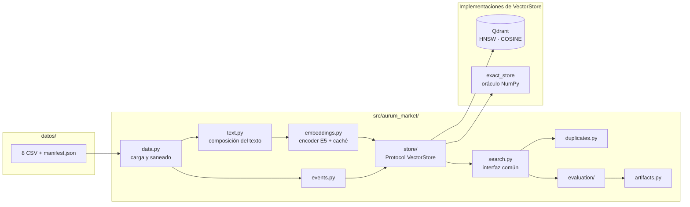

# Plan técnico · Aurum Market

**Cómo** se construye lo que especifica [01_spec.md](01_spec.md), respetando
[00_constitution.md](00_constitution.md).

---

## 1. Arquitectura



La pieza que sostiene todo es **`store/base.py`**: un `Protocol` con la misma
superficie para Qdrant y para el oráculo exacto. Eso permite ejecutar los
experimentos de representación (RF-06) sin ANN de por medio y, después, medir
exactamente cuánto ranking pierde el índice (RF-20) sin cambiar una línea de la
capa de evaluación.

---

## 2. Módulos y responsabilidades

| Módulo | Responsabilidad | RF |
|---|---|---|
| `config.py` | Cargar y **validar** `.env`. Falla al arrancar, no a mitad de la ingesta. | RF-18 |
| `contracts.py` | `CatalogRecord`, `SearchHit`, `CatalogEvent`, `DuplicateDecision`. Dataclasses inmutables. | RF-01, RF-12 |
| `data.py` | Único punto de carga, validación contra `manifest.json` y saneado de nulos. | RF-03, RF-07 |
| `text.py` | Estrategias de composición del texto a codificar. | RF-03, RF-06 |
| `embeddings.py` | Encoder con prefijos E5 + L2, caché `.npy` con checksum. | RF-04 |
| `store/base.py` | `Protocol VectorStore` + excepciones propias. | RF-01, RF-15 |
| `store/qdrant_store.py` | SDK nativo: esquema, HNSW, payload index, filtros, mutaciones. | RF-07, RF-08, RF-14 |
| `store/exact_store.py` | Oráculo exacto NumPy. | RF-20 |
| `ingest.py` | Lotes idempotentes + verificación previa a consultas. | RF-09, RF-10 |
| `search.py` | La interfaz común de recuperación. | RF-01, RF-13, RF-14, RF-15 |
| `events.py` | 24 eventos por `sequence` + medición de visibilidad. | RF-16 |
| `duplicates.py` | Generación de candidatos, regla y calibración. | RF-17, RF-23 |
| `baselines.py` | TF-IDF. | RF-02 |
| `evaluation/metrics.py` | nDCG@10, Recall@10, MRR@10 graduados. | RF-19 |
| `evaluation/fidelity.py` | Solapamiento ANN vs oráculo + barrido de `ef`. | RF-20 |
| `evaluation/latency.py` | p50/p95 con calentamiento. | RF-21 |
| `evaluation/attribution.py` | Clasificación de fallos por capa. | RF-24 |
| `artifacts.py` | Escritura + validación contra `specs/contracts/`. | RF-25 |
| `cli.py` | Todos los comandos. | RF-28 |

---

## 3. Representación · la relación métrica ↔ normalización ↔ score (RF-05)

Los vectores se generan con `normalize_embeddings=True`, de modo que todos tienen
norma L2 igual a 1. Bajo esa condición:

```
cos(a, b) = (a · b) / (‖a‖ ‖b‖) = a · b        cuando ‖a‖ = ‖b‖ = 1
```

El coseno y el producto interno inducen **el mismo orden**, y la distancia
euclídea es una función monótona decreciente del coseno:
`‖a − b‖² = 2 − 2·cos(a, b)`. Por eso elegir `COSINE` en Qdrant y usar un
producto matricial en el oráculo NumPy produce rankings comparables: **estamos
comparando el mismo orden, no números de escalas distintas.**

El score que devuelve Qdrant con `COSINE` es una **similitud en `[-1, 1]`**, donde
más alto es mejor. Se propaga tal cual (`score_kind="similarity"`,
`higher_is_better=True`) hasta el artefacto. Si algún día se cambiara la métrica
a una distancia, `score_kind` cambiaría con ella y el código de ordenación
seguiría siendo correcto sin tocarse: es exactamente lo que protege
[P-03](00_constitution.md).

**Consecuencia práctica:** la normalización no es un detalle de higiene. Es lo que
hace que el oráculo exacto sea un oráculo válido para el motor ANN.

---

## 4. Esquema de la colección (RF-07)

| Aspecto | Decisión | Por qué |
|---|---|---|
| Nombre | `aurum-market-catalogo` | Prefijo protegido por `validate_resource_name` |
| Dimensión | 384 | `multilingual-e5-small` |
| Métrica | `COSINE` | Coherente con vectores normalizados (§3) |
| ID del punto | `record_id` (UUIDv5) | Qdrant acepta UUID nativamente; da idempotencia por diseño |
| Payload | `product_id`, `title`, `brand`, `color`, `locale`, `catalog_version`, `active` | `product_id` es imprescindible: es lo que se reporta |
| Índice de payload | `KEYWORD` sobre `brand` | Sin él, el filtro no es una operación de base de datos eficiente (RF-14) |
| Nulos | Cadena vacía | Uniforme, decidido en `data.py` ([P-07](00_constitution.md)) |

### Configuración HNSW (RF-08)

`m=24`, `ef_construct=120` en la colección; `hnsw_ef=128` en la consulta.

Qdrant implementa **solo** HNSW para vectores densos: no hay una familia IVF o
PQ equivalente a la de FAISS. Eso significa que **perdemos** la posibilidad de
cambiar el compromiso memoria/recall vía cuantización (IVF-PQ) y de razonar sobre
`nprobe`. Lo que **sí** conservamos es el control de los tres parámetros que
gobiernan el grafo, y ahí está la palanca real:

- `m` — conexiones por nodo. Más alto mejora el recall y engorda el índice.
- `ef_construct` — amplitud de la búsqueda al construir. Sube la calidad del grafo y el tiempo de ingesta.
- `hnsw_ef` — amplitud en consulta. **Es el único parámetro ajustable sin reindexar**, y por eso es el que barremos para trazar la curva fidelidad/latencia (RF-20).

Los valores de partida son los de la sesión 03, para que la comparación con lo
trabajado en clase sea directa. El barrido de `hnsw_ef` es lo que justifica el
valor final, no la herencia.

---

## 5. Orden canónico de ejecución · ADR-001

**Este orden es obligatorio.** Las tres pruebas parten del mismo estado y los
eventos van al final, porque son los únicos que modifican la colección.

```
1. ingest                     catálogo completo
2. verify                     recuento + estado de indexación
3. experiment                 representación, con oráculo exacto
4. duplicates calibrate       umbral sobre altas_desarrollo.csv → congela config/final.yaml
5. evaluate                   nDCG/Recall/MRR, fidelidad ANN, latencia
6. duplicates predict         altas_evaluacion.csv con el umbral congelado
7. deliver                    los tres artefactos
8. events --apply --verify    prueba operativa aislada: idempotencia y visibilidad
```

**Por qué importa** (y es la trampa fina de esta actividad): los 24 eventos están
construidos para tocar exactamente los productos que las otras dos pruebas usan
como respuesta correcta.

| Grupo de eventos | A quién afecta |
|---|---|
| 8 `UPSERT` de fichas existentes | **7 de 7** referencias de `altas_desarrollo.csv` |
| 8 `DELETE` | **6 de 7** referencias de `altas_evaluacion.csv` |
| 8 `UPSERT` nuevos (`AURUM-NEW-*`) | Ninguna métrica: no figuran en los juicios de relevancia |

Aplicarlos antes de predecir duplicados **borraría seis de los siete candidatos**,
haciendo imposible que la base vectorial los genere y, con ello, que una
predicción positiva señale su `product_id` como exige el enunciado. Aplicarlos
antes de medir el ranking introduciría productos que los 248 juicios de
relevancia desconocen.

Los `AURUM-NEW-*` no están para puntuar: sus títulos responden a consultas
conocidas (`AURUM-NEW-001` "Taladro inalámbrico compacto 24 V con dos baterías"
frente a `EVAL-100455-direct` "taladro 24v batería") para que la visibilidad de
un alta pueda comprobarse con una **búsqueda semántica real** y no solo con una
lectura por ID.

**Consecuencia operativa:** el paso 8 modifica la colección de forma
irreversible, así que repetir el recorrido completo exige reingerir desde cero.
`aurum deliver` cubre los pasos 1 a 7 y nunca aplica eventos.

La justificación completa, con las citas del enunciado que la sostienen, está en
[ADR-001](decisiones/ADR-001-orden-canonico-de-ejecucion.md).

---

## 6. Interfaz de línea de comandos

| Comando | Qué hace |
|---|---|
| `aurum doctor` | Verifica Python, `.env`, datos, checksums y conectividad. No modifica nada. |
| `aurum embed --profile {sample,full}` | Genera y cachea embeddings. |
| `aurum ingest --profile {sample,full}` | Ingesta idempotente por lotes. |
| `aurum verify` | Recuento y estado de indexación. |
| `aurum search "consulta" [--brand M] [--top-k N]` | Búsqueda ad-hoc para inspección manual. |
| `aurum experiment [--profile]` | Matriz E0–E3 con el oráculo exacto. |
| `aurum events --apply --verify` | Aplica los 24 eventos y mide visibilidad. |
| `aurum duplicates calibrate` | Barrido de umbral sobre desarrollo. |
| `aurum duplicates predict` | Decisiones sobre evaluación con el umbral congelado. |
| `aurum evaluate [--sweep-ef]` | Métricas, fidelidad ANN y latencia. |
| `aurum deliver` | **Comando único** que regenera los tres artefactos (RF-28). |
| `aurum reset` | Destructivo. Requiere doble confirmación ([P-11](00_constitution.md)). |

---

## 7. Estrategia de pruebas

| Nivel | Marcador | Qué cubre |
|---|---|---|
| Unitario | *(ninguno)* | Métricas contra valores calculados a mano, saneado de nulos, contrato UUIDv5, regla de duplicados, validación de artefactos. Corren sin Docker. |
| Integración | `integration` | Esquema de la colección, idempotencia de la ingesta, filtros nativos, mutaciones y visibilidad. Requieren `make up`. |
| Lento | `slow` | Catálogo completo y descarga de modelos. |

Los tests de los **siete puntos de "Antes de entregar"** viven agrupados en
`tests/test_entrega.py` para poder ejecutarlos como comprobación final.

---

## 8. Decisiones registradas

| ADR | Decisión | Estado |
|---|---|---|
| ADR-001 | Orden canónico de ejecución y su efecto en la calibración de duplicados (§5) | aceptada |
| ADR-002 | Qdrant como motor, frente a Chroma y Milvus Lite | aceptada |
| ADR-003 | Sin FAISS: el oráculo exacto es un producto matricial NumPy | aceptada |
| ADR-004 | Umbral de relevancia `>= 2` para Recall y MRR (RF-19) | aceptada |
